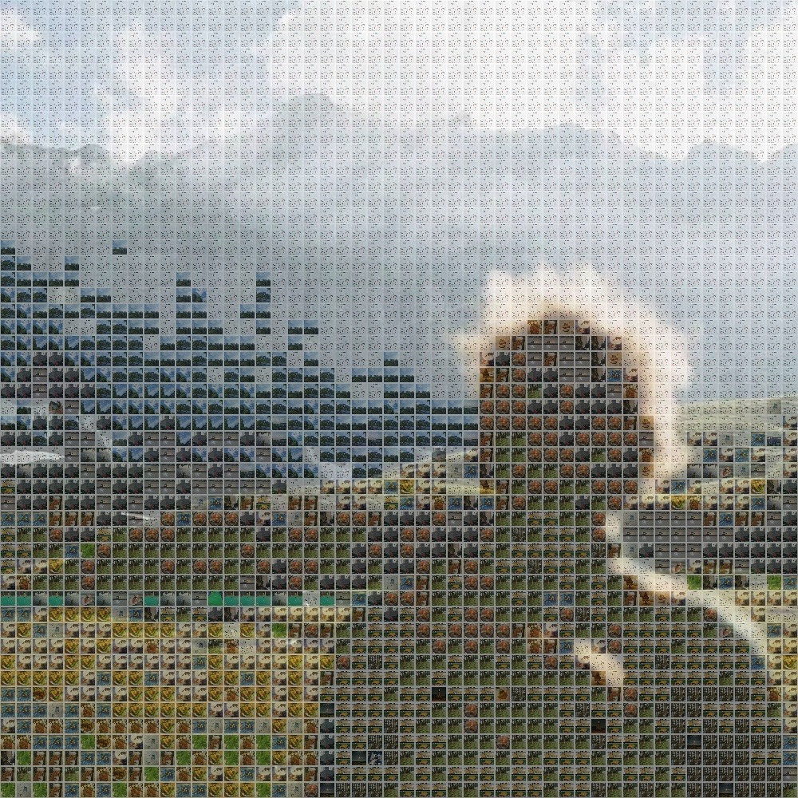

# Multi-image_stitching
 为自己微信头像做个拼接图

[相似度部分参考](https://zhuanlan.zhihu.com/p/68215900) 
[感知哈希参考](https://blog.csdn.net/enter89/article/details/90293971)

| 算法  | Runtime |
| ----- | ------- |
| DIY   | 00:03   |
| hist  | 02:19   |
| ssim  | 02:08   |
| phash | 02:13   |
| cos   | 02:14   |

